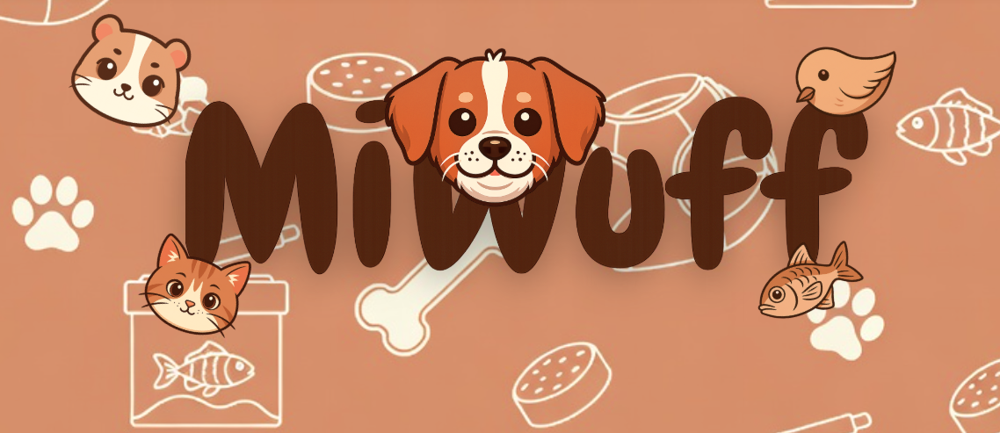

# Miwuff - Tienda Online de Mascotas

Bienvenido a **Miwuff**, una plataforma de comercio electrónico moderna y dinámica diseñada para los amantes de las mascotas. Este proyecto ofrece una experiencia de usuario completa para la compra de productos para perros, gatos, roedores, peces y pájaros, combinando un diseño atractivo con funcionalidades esenciales de e-commerce.


*(Imagen representativa del proyecto)*

## Descripción

Miwuff es una Single Page Application (SPA) simulada construida con tecnologías web estándar. El objetivo del proyecto es proporcionar una interfaz intuitiva y amigable donde los usuarios pueden navegar por categorías, ver detalles de productos, gestionar un carrito de compras y realizar pedidos simulados. El diseño se centra en la estética visual ("wow effect") y la facilidad de uso.

## Características Principales

*   **Página de Inicio Dinámica:**
    *   Carrusel de imágenes animado.
    *   Secciones de productos destacados cargados dinámicamente.
    *   Accesos directos visuales a las diferentes categorías de animales.
    *   Pop-up de ofertas promocionales.

*   **Carrito de Compras Funcional:**
    *   Agregar productos desde el catálogo o la página de detalles.
    *   Persistencia de datos utilizando `localStorage` (el carrito no se borra al recargar).
    *   Cálculo automático de totales.
    *   Gestión de cantidades y eliminación de artículos.

*   **Catálogo y Categorías:**
    *   Filtrado de productos por categoría (Perros, Gatos, Roedores, Peces, Pájaros).
    *   Carga de datos de productos desde archivos JSON locales.

*   **Detalles del Producto:**
    *   Vista detallada con descripción, precio, valoraciones y opciones de compra.

*   **Gestión de Usuarios:**
    *   Sistema de Login y Registro con validaciones visuales.
    *   Interfaz de autenticación con transiciones suaves.

*   **Proceso de Checkout:**
    *   Formulario de pago y envío validado.
    *   Resumen de pedido antes de la confirmación.

*   **Internacionalización:**
    *   Soporte básico para cambio de idioma (implementado mediante `idioma.js`).

*   **Diseño Responsivo y Moderno:**
    *   Estilos personalizados con CSS puro (Glassmorphism, gradientes, animaciones).
    *   Adaptable a diferentes tamaños de pantalla.
    *   Modo Oscuro (Dark Mode) disponible.

## Tecnologías Utilizadas

Este proyecto ha sido desarrollado utilizando las siguientes tecnologías:

*   **HTML5:** Estructura semántica del contenido.
*   **CSS3:** Diseño visual, animaciones, Flexbox y Grid Layout. No se han utilizado frameworks CSS pesados, priorizando estilos personalizados.
*   **JavaScript (ES6+):** Lógica del lado del cliente, manipulación del DOM, gestión de eventos y almacenamiento local.
*   **JSON:** Almacenamiento y estructura de datos para el catálogo de productos.
*   **Iconify:** Iconos vectoriales para una interfaz limpia.

## Estructura del Proyecto

```text
Proyecto-Mascota/
├── assets/
│   ├── css/              # Hojas de estilo para cada sección (login, carrito, etc.)
│   ├── img/              # Imágenes de productos, banners e iconos
│   ├── javascript/       # Lógica de negocio (carrito.js, login.js, etc.)
│   └── JSON/             # Base de datos simulada de productos
├── index.html            # Página principal
├── productos.html        # Catálogo de productos
├── detalle_producto.html # Vista individual de producto
├── carrito.html          # Vista del carrito de compras
├── checkout.html         # Página de finalización de compra
├── login.html            # Páginas de autenticación
├── nav.html              # Fragmento de navegación (cargado dinámicamente)
└── footer.html           # Fragmento de pie de página (cargado dinámicamente)
```

## Instalación y Uso

Este proyecto no requiere un servidor backend complejo para funcionar en modo desarrollo, ya que utiliza archivos estáticos y `localStorage`.

1.  **Clonar el repositorio** (o descargar los archivos):
    ```bash
    git clone <url-del-repositorio>
    ```

2.  **Abrir el proyecto:**
    Navega a la carpeta del proyecto y abre el archivo `index.html` en tu navegador web favorito (Chrome, Firefox, Edge).

    > **Nota:** Para una mejor experiencia y evitar problemas con las políticas de CORS al cargar módulos o archivos JSON, se recomienda usar una extensión como "Live Server" en VS Code.

## Contribución

Las contribuciones son bienvenidas. Si deseas mejorar este proyecto, por favor:

1.  Haz un Fork del repositorio.
2.  Crea una rama para tu característica (`git checkout -b feature/NuevaCaracteristica`).
3.  Haz commit de tus cambios (`git commit -m 'Agrega nueva característica'`).
4.  Haz push a la rama (`git push origin feature/NuevaCaracteristica`).
5.  Abre un Pull Request.

## Autores

Este proyecto ha sido desarrollado por el siguiente equipo:

*   **Naia** 
*   **Yeremi** 
*   **Santiago Patiño**
*   **Eder**
*   **Gabriel Hernández**

## Licencia

Este proyecto es de uso libre para fines educativos y personales.

---
*Desarrollado con ❤️ para las mascotas.*
